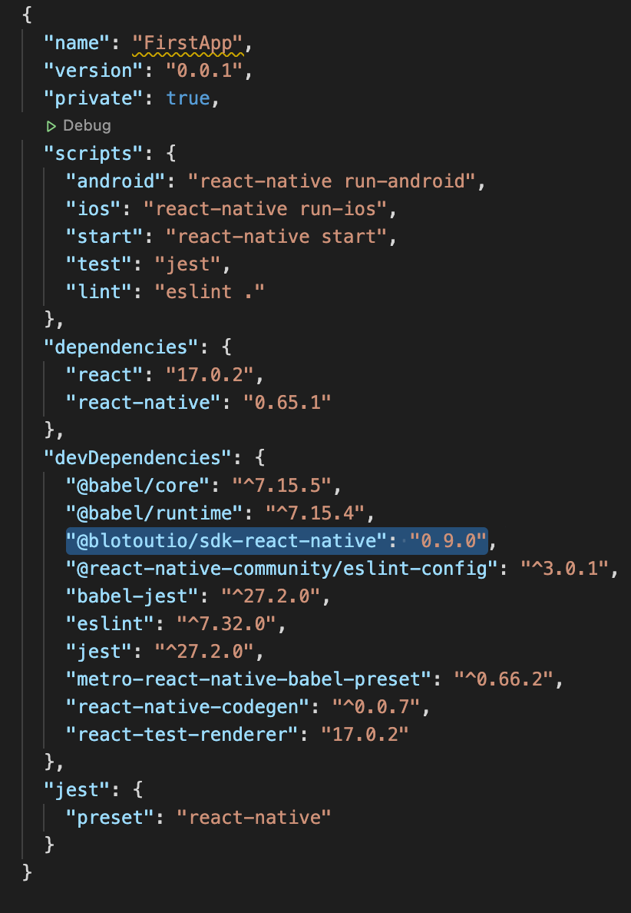

# Integration


## Add Blotout Analytics SDK into your project

To add the SDK to the React native project, Please add @blotoutio/sdk-react-native as devDependencies in your project's package.json . Please refer to the image below for recommended settings. Please run npm install after that. 




## Initialization


 Please initialize the BlotoutAnalytics in Android Application class.

```React Native
import RNBlotOutSDKModule from '@blotoutio/sdk-react-native';

RNBlotOutSDKModule.init(
    'XXXXXX',
    'https://XXXX/',
  );

```
